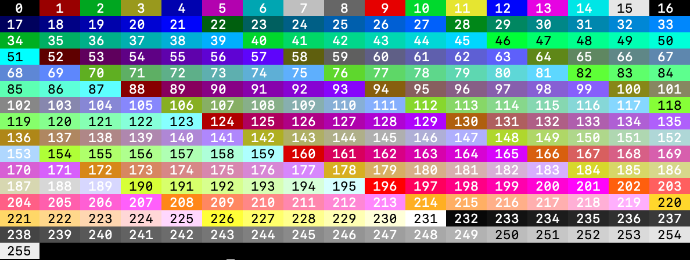

# xLog
xLog allows you to output logs in your console or terminal with a little _zing_.
This package provides an easy-to-use interface to <span style="color:red">colorize</span>, _italicize_, **bolden**, <span style="text-decoration: underline">underline</span> (and much more!) your python logs by simply setting exactly what you need in an xLog class.

This documentation will highlight how you can do this in the sections below - but if you are too excited to wait, you can clone the package now and run `python3 xlog.py --help` which will provide a helpful interactive interface which allows you to navigate to sections you would like to know more about.

<h1>Contents</h1>

1. [fg (foreground)](#fg)
    * [Escape Codes](#fg-escape)
    * [RGB](#fg-rgb)
    * [8-bit Colors](#fg-8bit)
2. [bg (background)](#bg)
    * [Escape Codes](#bg-escape)
    * [RGB](#bg-rgb)
    * [8-bit Colors](#bg-8bit)
3. [styles](#styles)
4. [func](#func)
    * [Output](#output)
    * [Errors](#errors)
5. [Return a string](#return-string)


<h1 id="fg">fg (foreground)</h1>
The fg parameter allows you to set the color of the text. There are several ways to do this, elaborated below:


<h2 id="fg-escape">Escape Codes</h2>

Here is the table of escape codes available:

| Name | Escape Code | Name | Escape Code |
| ----------- | ----------- | ----------- | ----------- |
| <span style="color: rgb(1,1,1); background-color: white">black </span> | 30 | <span style="color: rgb(128,128,128)">black_hi</span> | 90 |
| <span style="color: rgb(222,56,43)">red</span> | 31 | <span style="color: rgb(255,0,0)">red_hi</span> | 91 |
| <span style="color: rgb(57,181,74)">green</span> | 32 | <span style="color: rgb(0,255,0)">green_hi</span> | 92 |
| <span style="color: rgb(255,199,6)">yellow</span> | 33 | <span style="color: rgb(255,255,6)">yellow_hi</span> | 93 |
| <span style="color: rgb(0,111,184)">blue</span> | 34 | <span style="color: rgb(0,0,255)">blue_hi</span> | 94 | 
| <span style="color: rgb(118,38,113)">magenta</span> | 35 | <span style="color: rgb(255,0,255)">magenta_hi</span> | 95 | 
| <span style="color: rgb(44,181,233)">cyan</span> | 36 | <span style="color: rgb(0,255,255)">cyan_hi</span> | 96 | 
| <span style="color: rgb(204,204,204)">white</span> | 37 | <span style="color: rgb(255,255,255); background-color: black">white_hi</span> | 97 |

To implement any of these colors in your prompt, you can set `fg` to the name of the color (on the left) **_or_** the escape code (on the right).

For example:

```
from xlog import xLog

prompt = xLog(fg="red") # Or you can set fg=31
prompt("I am in red!")
```


<h2 id="fg-rgb">RGB</h2>

To use the RGB color scheme, you can pass a tuple of length 3 with RGB values.

```
from xlog import xLog

prompt = xLog(fg=(31, 165, 161)) # A kind of teal color
prompt("I was made by using RGB colors!")
```

> \> <span style="color: rgb(31,165,161)">I was made by using RGB colors!</span>

<h2 id="fg-8bit">8-bit Colors</h2>
Finally, we can use 8-bit colors, defined in a range from 0 to 255:



**_NOTE_**: When using an 8-bit color for the foreground, you must use the `fg_255` parameter (as opposed to `fg`). If you set `fg` at the same time, `fg_255` will take precedence. 

Example with 8-bit coloring:

```
from xlog import xLog

prompt = xLog(fg_255=214)
prompt("I would call this color pumpkin!")
```
> \> <span style="color: rgb(255,175,0)">I would call this color pumpkin!</span>

<h1 id="bg">bg (background)</h1>
The bg parameter will set the background color of the string you pass in the xLog object.


<h2 id="bg-escape">Background Escape Codes</h2>
Your background color options are:

| Name | Escape Code | Name | Escape Code |
| ----------- | ----------- | ----------- | ----------- |
| <span style="background-color: rgb(1,1,1); color: white">black</span> | 40 | <span style="background-color: rgb(128,128,128)">black_hi</span> | 100 |
| <span style="background-color: rgb(222,56,43)">red</span> | 41 | <span style="background-color: rgb(255,0,0)">red_hi</span> | 101 |
| <span style="background-color: rgb(57,181,74); color: black">green</span> | 42 | <span style="background-color: rgb(0,255,0); color: black">green_hi</span> | 102 |
| <span style="background-color: rgb(255,199,6); color: black">yellow</span> | 43 | <span style="background-color: rgb(255,255,6); color: black">yellow_hi</span> | 103 |
| <span style="background-color: rgb(0,111,184)">blue</span> | 44 | <span style="background-color: rgb(0,0,255)">blue_hi</span> | 104 | 
| <span style="background-color: rgb(118,38,113)">magenta</span> | 45 | <span style="background-color: rgb(255,0,255); color: black">magenta_hi</span> | 105 | 
| <span style="background-color: rgb(44,181,233); color: black">cyan</span> | 46 | <span style="background-color: rgb(0,255,255); color: black">cyan_hi</span> | 106 | 
| <span style="background-color: rgb(204,204,204); color: black">white</span> | 47 | <span style="background-color: rgb(255,255,255); color: black">white_hi</span> | 107 |

Implementing background escape code colors is almost identical to setting the foreground colors (you just use the bg parameter instead):

```
from xlog import xLog

prompt = xLog(bg="red_hi") # can equally do `bg=101`
prompt("I am red, red is me")
```
> \> <span style="background-color: rgb(255,0,0)">I am red, red is me</span>

<h2 id="bg-rgb">RGB</h2>
Using the RGB color scheme for background colors is identical to that of the foreground colors, with the only difference being that the `bg` parameter should be used instead:

```
from xlog import xLog

prompt = xLog(bg=(135,0,255))
prompt("A cool d color!")
```
> \> <span style="background-color: rgb(135,0,255)">A cool background color!</span>

<h1 id="styles">styles</h1>

The style parameter allows you to print various font styles such as **bold**, *italic*, <span style="text-decoration: underline">underline</span> etc.

Your escape code style options are:

| name | Description |
| ----------- | ----------- |
| **bold** | 1 |
| <span style="color: rgb(79,79,79)">faint</span> | 2 |
| _italic_ | 3 |
| <span style="text-decoration: underline">underline</span> | 4 |
|  | 5 |
| ~~strikethrough~~ | 9 |

<span style="font-size:10px">Note: this table may be expanded if necessary or upon request</span>

You can implement one style or several styles simultaneously.

We can set one particular style in the following way:
```
from xlog import xLog

prompt_1 = xLog(style=1) # you can also set style="bold"
prompt_1("Look, i'm bold!")
```
> \> **Look, i'm bold!**

You can also utilise several different styles by setting the `styles` parameter to a set, list or tuple containing the styles name or escape codes:

```
from xlog import xLog

prompt = xLog(style=[1, "italic", 4]) # Yes, you can mix and match different data types!
prompt("I'm bold, italic and underlined!")
```
> \> <span style="text-decoration: underline">**_I'm bold, italic and underlined!_**</span>

<h1 id="func">func</h1>

<h2 id="output">Output</h2>
You can specify which function you want to use to output your prompts. The built-in `print` function is used by default.

For example:

```
from xlog import xLog
import logging

prompt = xLog(fg="green", func=logging.warning)
prompt("I am the Grinch!")
```
> \> WARNING:root:<span style="color: rgb(57,181,74)">I am the Grinch!</span>

<h2 id="raising-errors">Raising Errors</h2>
You can also use `xLog` to raise errors by setting `func` as an exception class:

```
class CustomError(Exception):
    pass

err_prompt = xLog(bg=101, func=CustomError)
err_prompt("This custom error has been raised!")
```

> \> \_\_main\_\_.CustomError: <span style="background-color: rgb(255,0,0)">This custom error has been raised!</span>

<h2 id="return-str">Returning a string</h2>

If you do not feel like printing your (cooler looking) texts just yet, you have the option to save the string (along with the colors and styles) to be printed later if you wish.

This is done via the `return_str` method:

```
from xlog import xLog

prompt = xLog(fg="red_hi", bg=44, styles = [1, "italic"])
xlog_str = prompt.return_str("I will be printed later, and it will be great!")

# Do whatever you like in-between

print(xlog_str)
```

> \> <span style="background-color: rgb(0,0,255); color: rgb(255,0,0)">**_I will be printed later, and it will be great!_**</span>
